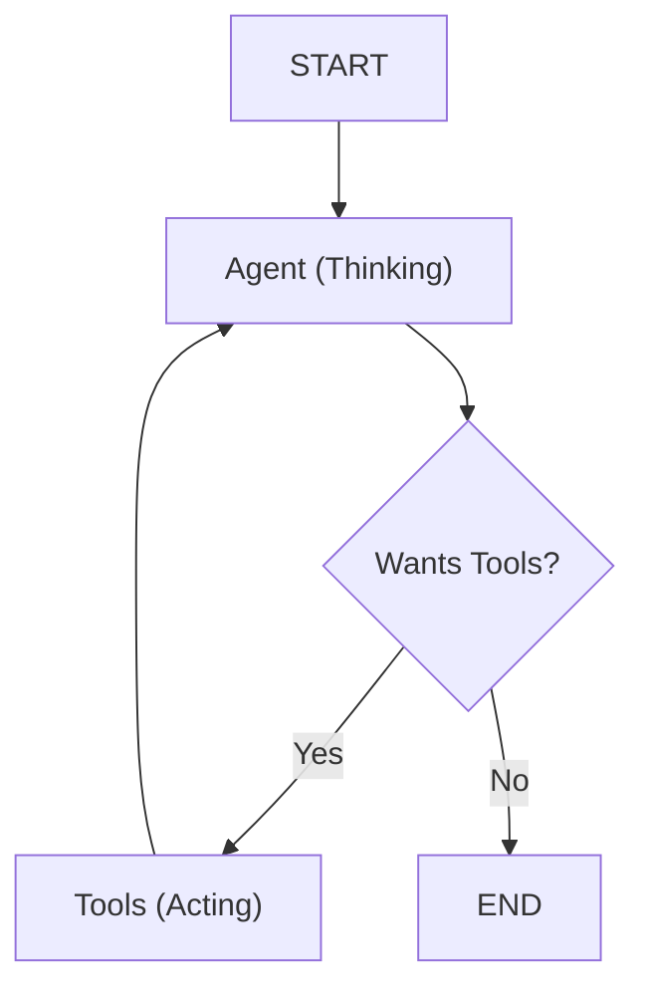

# 🧠 Core Agentic Concepts in GetSetGoAI

This project utilizes state-of-the-art AI orchestration to move beyond simple chat responses into a "Reasoning and Acting" (ReAct) paradigm.

## 1. LangGraph: Cognitive Orchestration
Unlike a linear script, **LangGraph** allows the agent to loop, branch, and backtrack.
- **Agent Node**: This is where the LLM (Large Language Model) processes the `SYSTEM_PROMPT` and user query. It generates a thought process and decides on a "Path".
- **Tools Node**: When the Agent decides it needs data (e.g., "What's the weather in Tokyo?"), the workflow switches to this node to execute Python functions.
- **Conditional Routing**: After every thought, the graph asks: *"Is the answer complete, or do I need more tool data?"* This cycle continues until a comprehensive plan is ready.

## 2. Advanced Tool Usage
The agent doesn't just "talk"; it "does".
- **Real-time Research**: Uses Tavily and SerpAPI to find actual hotel links and restaurant prices.
- **Currency Intelligence**: When a user selects a currency (e.g., INR), the agent is instructed via metadata to use the `convert_currency` tool to translate all discovered global prices into the preferred local currency.

## 3. Stateful Memory & Persistence
GetSetGoAI remembers the context of your trip across multiple messages.
- **Thread Management**: Each user session is tracked by a `thread_id`.
- **Checkpointing**: Every state of the conversation is saved. If the agent finds a hotel in message 1, and you ask "Is there a pool?" in message 2, it knows exactly which hotel you are talking about.

## 4. High-Concurrency Non-Blocking Backbone
The entire I/O layer of GetSetGoAI is built on a **Non-Blocking Architecture**.
- **Yielding the Event Loop**: We use `httpx.AsyncClient` instead of `requests`. When the agent queries weather or search data, the event loop is yielded, allowing the server to handle other concurrent requests.
- **Efficient Workflow Orchestration**: The LangGraph workflow ensures that even complex, multi-step agent reasoning doesn't saturate the server thread, maximizing system throughput.

## 5. Dynamic Service Authentication (BYOK)
GetSetGoAI implements a "Bring Your Own Key" (BYOK) model for professional scalability.
- **Runtime Injection**: API keys provided by the user in the UI are passed into the LangGraph `config`.
- **Stateless Auth**: The tools extract these keys dynamically during execution. The keys exist only in the user's session memory, ensuring privacy and zero cost for the host.

---

### Workflow Visualization (Non-Blocking)

